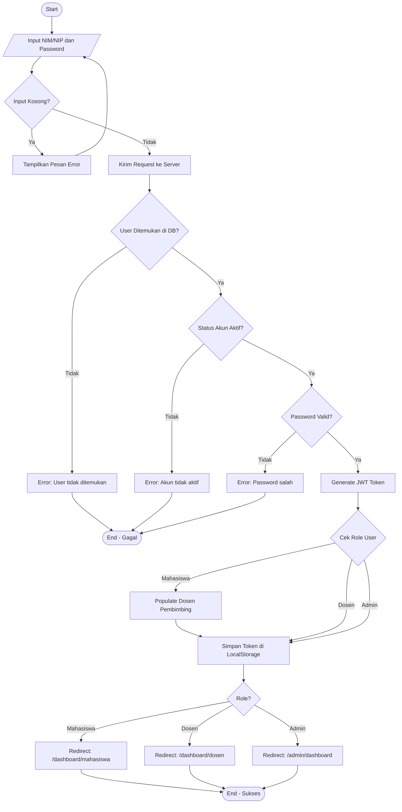

# ACTIVITY DIAGRAM - PROSES LOGIN SIMTA
## Berdasarkan Analisis Kode authController.js dan Login.tsx

---

## Alur Logika Kode (Hasil Analisis):

### Frontend (Login.tsx):
1. User input username (NIM/NIP) dan password
2. Validasi input tidak kosong (line 44-46)
3. Dispatch action login ke Redux
4. Setelah sukses, redirect berdasarkan role (line 24-31)

### Backend (authController.js):
1. Cari user berdasarkan NIM/NIP (line 26)
2. Cek apakah user ditemukan (line 28-33)
3. Cek status akun aktif (line 36-40)
4. Validasi password dengan bcrypt (line 43-50)
5. Generate JWT token (line 53)
6. Populate dospem jika mahasiswa (line 56-58)
7. Return response sukses (line 66-70)

---

## Kode Mermaid.js - Activity Diagram



---

## Kode untuk Draw.io (Format XML/Mermaid compatible)

Copy kode di bawah ini ke Mermaid Live Editor (mermaid.live), lalu export sebagai SVG dan import ke Draw.io:

```
flowchart TD
    A([Start]) --> B[/Input NIM/NIP dan Password/]
    B --> C{Input Kosong?}
    C -->|Ya| D[Tampilkan Pesan Error]
    D --> B
    C -->|Tidak| E[Kirim Request ke Server]
    E --> F{User Ditemukan di DB?}
    F -->|Tidak| G[Error: User tidak ditemukan]
    G --> H([End - Gagal])
    F -->|Ya| I{Status Akun Aktif?}
    I -->|Tidak| J[Error: Akun tidak aktif]
    J --> H
    I -->|Ya| K{Password Valid?}
    K -->|Tidak| L[Error: Password salah]
    L --> H
    K -->|Ya| M[Generate JWT Token]
    M --> N{Cek Role User}
    N -->|Mahasiswa| O[Populate Dosen Pembimbing]
    O --> P[Simpan Token di LocalStorage]
    N -->|Dosen| P
    N -->|Admin| P
    P --> Q{Role?}
    Q -->|Mahasiswa| R[Redirect: /dashboard/mahasiswa]
    Q -->|Dosen| S[Redirect: /dashboard/dosen]
    Q -->|Admin| T[Redirect: /admin/dashboard]
    R --> U([End - Sukses])
    S --> U
    T --> U
```

---

## Penjelasan Simbol:

| Simbol | Arti | Kode Mermaid |
|--------|------|--------------|
| Stadium (oval) | Start/End | `([Start])` |
| Kotak | Proses/Action | `[Proses]` |
| Trapesium | Input/Output | `[/Input/]` |
| Diamond | Decision | `{Kondisi?}` |
| Panah | Flow | `-->` |
| Panah + Label | Flow dengan kondisi | `-->|Ya|` |

---

## Mapping Kode ke Activity:

| Activity | Kode Backend | Kode Frontend |
|----------|--------------|---------------|
| Input NIM/NIP dan Password | - | `Login.tsx:44-46` |
| Validasi Input Kosong | - | `!username.trim() \|\| !password.trim()` |
| Cari User di DB | `User.findByNimNip(nim_nip)` | - |
| Cek User Ditemukan | `if (!user)` | - |
| Cek Status Aktif | `if (user.status !== 'aktif')` | - |
| Validasi Password | `user.comparePassword(password)` | - |
| Generate Token | `generateTokenPair(user)` | - |
| Populate Dospem | `user.populate('dospem_1 dospem_2')` | - |
| Redirect Dashboard | - | `navigate(dashboards[user.role])` |

---

*Dokumen Activity Diagram untuk BAB 4 Skripsi*
*SIMTA - Institut Teknologi Batam 2024*
