# ACTIVITY DIAGRAM SWIMLANE - LOGIN SIMTA
## 3 Diagram Terpisah untuk Admin, Dosen, dan Mahasiswa

---

# 1. ACTIVITY DIAGRAM - LOGIN ADMINISTRATOR

```mermaid
flowchart TB
    subgraph Admin["👤 ADMINISTRATOR"]
        A1([Mulai])
        A2[Membuka Halaman Login]
        A3[Memasukkan NIP dan Password]
        A4{Menerima Hasil}
        A5[Masuk ke Dashboard Admin]
        A6[Melihat Pesan Kesalahan]
        A7([Selesai])
    end

    subgraph Sistem["⚙️ SISTEM"]
        S1[Menampilkan Form Login]
        S2[Memeriksa Kelengkapan Data]
        S3{Data Lengkap?}
        S4[Mengirim Data ke Database]
        S5[Menerima Hasil Validasi]
        S6{Login Berhasil?}
        S7[Menyimpan Sesi Pengguna]
        S8[Menampilkan Dashboard Admin]
        S9[Menampilkan Pesan Error]
    end

    subgraph Database["🗄️ DATABASE"]
        D1[Mencari Data Admin]
        D2{Admin Ditemukan?}
        D3[Mencocokkan Password]
        D4{Password Sesuai?}
        D5[Mengembalikan Data Admin]
        D6[Mengembalikan Pesan Gagal]
    end

    A1 --> A2
    A2 --> S1
    S1 --> A3
    A3 --> S2
    S2 --> S3
    S3 -->|Tidak| S9
    S9 --> A6
    A6 --> A3
    S3 -->|Ya| S4
    S4 --> D1
    D1 --> D2
    D2 -->|Tidak| D6
    D6 --> S5
    D2 -->|Ya| D3
    D3 --> D4
    D4 -->|Tidak| D6
    D4 -->|Ya| D5
    D5 --> S5
    S5 --> S6
    S6 -->|Tidak| S9
    S6 -->|Ya| S7
    S7 --> S8
    S8 --> A5
    A5 --> A7
```



---

# 2. ACTIVITY DIAGRAM - LOGIN DOSEN


---

# 3. ACTIVITY DIAGRAM - LOGIN MAHASISWA


---

## Cara Menggunakan:

1. Buka [mermaid.live](https://mermaid.live/)
2. Copy salah satu kode diagram di atas (tanpa backtick ```)
3. Paste dan lihat hasilnya
4. Export sebagai PNG/SVG
5. Import ke Draw.io jika perlu

---

## Perbedaan Ketiga Diagram:

| Aspek | Admin | Dosen | Mahasiswa |
|-------|-------|-------|-----------|
| Input | NIP | NIP | NIM |
| Dashboard | Dashboard Admin | Dashboard Dosen | Dashboard Mahasiswa |
| Proses Tambahan | - | - | Mengambil Data Dosen Pembimbing |

---

*Activity Diagram Swimlane untuk BAB 4 Skripsi SIMTA*
*Institut Teknologi Batam 2024*
